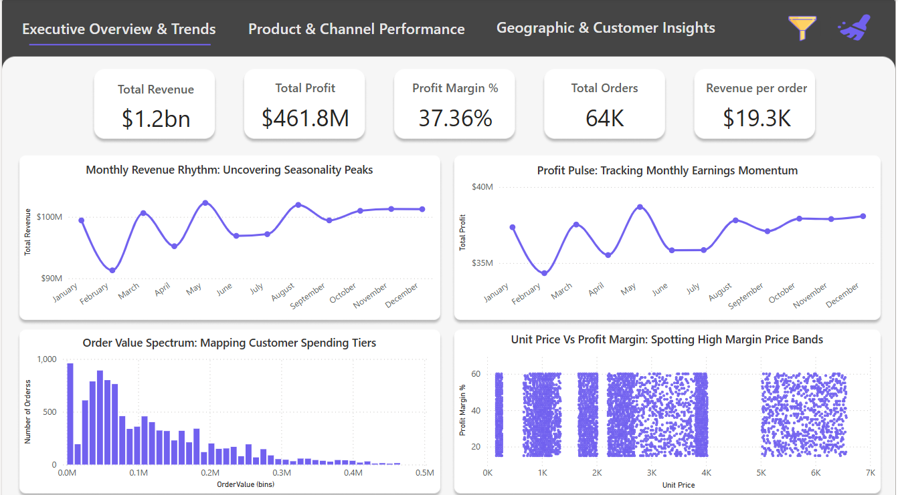

# 📊 Amazon Regional Sales Analysis 

A complete end-to-end **Exploratory Data Analysis (EDA)** and **Power BI Dashboard** project aimed at uncovering trends and profitability drivers from Amazon's regional sales data across the U.S. Spanning five years of historical records, this analysis provides actionable business insights and supports strategic decision-making.

---

## 🚀 Project Objective

Amazon's regional sales teams lacked a clear, data-driven understanding of revenue swings, SKU performance, and regional contributions. This project aims to:

- Analyze and visualize regional sales patterns using historical data.
- Equip decision-makers with a **live dashboard** for real-time self-service insights.
- Support executive-level strategy using clearly defined KPIs and segment-based performance.

---

## 🧠 Business Problem

> Inconsistent revenue and profit performance across U.S. regions, combined with a lack of visibility into seasonality, high-margin products, and channel effectiveness.

- Sales teams were operating with limited context about which geographies or customers were underperforming.
- Marketing and operations lacked clarity on when to scale campaigns or inventory due to unclear seasonal patterns.

---

## 🛠️ Tools & Technologies Used

- **Python (Jupyter Notebook)** – Data cleaning, transformation, and visualization using:
  - `pandas`, `numpy`, `matplotlib`, `seaborn`
- **Power BI** – Created a 3-page interactive dashboard with filters and bookmarks for dynamic exploration.
- **Excel** – Used for initial data validation and to combine raw .csv exports for import into BI tools.

### Key Functionalities:
- Cross-filtering across product, channel, and region dimensions.
- Drilldowns and segmentation based on customers, margins, and time.

---

## 📁 Dataset Overview

- **Timeframe**: 2015–2019 | **Scope**: Nationwide U.S. sales
- ~50K records merged from multiple sources (Products, Customers, Sales, State–Region, Budget)

### Key Columns:
- `order_number`, `order_date`, `customer_name`, `channel`, `product_name`
- Financials: `quantity`, `unit_price`, `revenue`, `cost`, `profit`, `profit_margin_pct`
- Geo: `state`, `region`, `lat`, `lon` | Calendar: `order_month_num`, `order_month_name`

---

## 🧹 Data Cleaning & Feature Engineering

- Unified column names and formats across datasets.
- Merged six tables with no predefined relationships using keys and mapping logic.
- Created profit margin percentages and region-based aggregations for slicing dashboards.

### Notable Work:
- Verified **no missing or duplicate rows** post-cleaning.
- Created date hierarchy fields to support time-based drilldowns.

---

## 📈 Key Insights

- **Seasonality**: Revenue consistently peaks in Q2 (May–June), with lowest points in January and April.
- **Product Focus**: 2 SKUs (Product 25 & 26) alone generate nearly 25% of total sales.
- **Channel Breakdown**:
  - Wholesale: Largest share (54.1%)
  - Export: Smallest share, but best profit margins (~38%)

### Regional Trends:
- **California** dominates both orders and revenue.
- **Midwest and Northeast** underperform in volume but offer untapped growth potential.

---

## 💡 Recommendations

- Launch **seasonal promotions** in April to recover from revenue dips.
- Reinvest in high-performing SKUs and consider dropping or repricing low-margin items.
- **Replicate California’s strategy** (product/channel mix) in mid-tier regions.
- Encourage **Export partnerships** for margin uplift while maintaining volume in Wholesale.

---

## 📊 Power BI Dashboard Preview

- **Page 1**: Regional Sales Performance Summary
- **Page 2**: Customer Segmentation by Revenue & Profit Margin
- **Page 3**: Revenue Scenario Modeling (based on SKU, region, channel)

### Dashboard Features:
- Interactive filtering by date, region, channel, and product.
- Correlation matrix heatmaps and customer margin classification.
- Choropleth map showing revenue by state with zoom and tooltip features.

> 📌 Screenshot:

---

## 📦 Files Included

- `EDA_Regional_Sales_Analysis.ipynb` – Python EDA script with visualizations
- `Regional Sales Dataset.xlsx` – Cleaned dataset
- `amazon_sales_report.pbix` – Interactive Power BI dashboard
- `Amazon_Sales_Analysis_PPT.pptx` – Slide deck summarizing insights and business recommendations

---

## 🏁 Conclusion

This project demonstrates a **complete data-to-dashboard pipeline** that delivers real business value. By transforming raw transactional data into insights, sales and leadership teams gain a deeper understanding of:

- When and where to sell
- Who the most valuable customers are
- Which channels and SKUs deliver the best margins

This analysis not only helps in **strategic sales planning** but also builds a **reusable Power BI framework** for future sales and operational data.

---

## 🔗 Use Cases

- Sales Forecasting & Campaign Targeting  
- Channel & SKU Profitability Assessment  
- Executive Reporting and Dashboards  
- Customer Segmentation and Relationship Planning  

---

## 👨‍💼 Ideal For

✔️ Data Analyst / Business Analyst Portfolio  
✔️ Power BI / Dashboard Projects  
✔️ Resume Showcases (EDA + Visualization)  
✔️ Strategic Consulting or BI Case Study

---

## 📧 Contact

**Gaurav Jangid**    
GitHub: [github.com/your-gaur8av](https://github.com/gaur8av)

---

